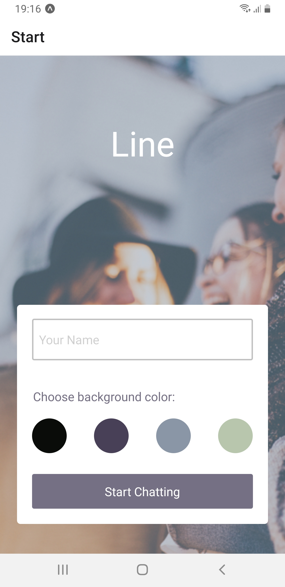
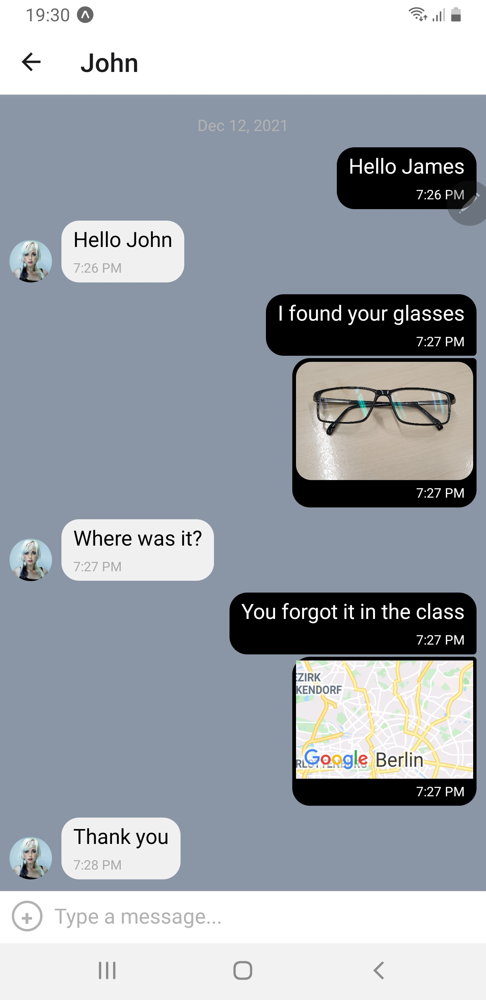

<h1>Connector</h1>

Connector is a basic chat-app built with React Native. In addition to chat the app provides the ability to share photos from your media, to take photos with you camera and share your current location.

<h1>Stack</h1>

- Node.js
- React Native
- Expo
- Gifted Chat
- Google Firebase Firestore

<h1>How to use</h1>

1. Install node.js and npm
2. Install Expo `npm install --global expo-cli`
3. Download the code
4. After downloading the code open the project folder in your terminal
5. Run `npm install` to install all the dependencies
6. To run the app on a device install an emulator or expo go on your smartphone
7. To start the app run `expo start`
8. Scan the QR Code with expo go